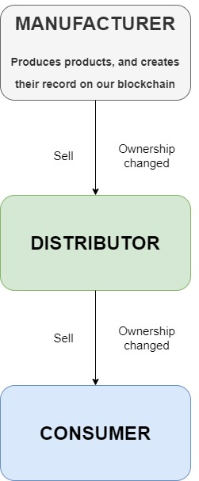

A blockchain-based Product Ownership Management System to detect and prevent counterfeit products in the supply chain.

### Note: This project is under development.

# Table of Contents
+ [About](#description)
+ [Getting Started](#getting_started)
+ [Deployment](#deployment)
+ [Technology Stack](#techstack)

## About <a name="description"></a>
+ In today’s world, how do you know if you are buying a genuine product?
+ We leverage the idea of Bitcoin’s blockchain that anyone can check the proof of possession of balance. Along with this, we plan to use QR codes.
+ We plan to implement a proof-of-concept system employing a blockchain-based decentralized application which gives a customer the entire history of a product ownership (eg - brand info, owner, etc).

### Data Flow


### Why blockchain? <a name="why_blockchain"></a>
+ Unlike a normal database, Blockchain has a non-destructive (immutable) way to track data changes over time. This means that data is not editable rather, whenever updates are made, a new block is added to the “block-chain”. This helps track historical data (authenticity and owner data) of a product.
+ Given the amount of data to be dealt with (large amount of products being developed), if you have to keep track of all of them, it is better to have a decentralized and distributed network of nodes so that no entity can tamper with the product data and we also obtain 100% up time.
+ Transparent nature of the Blockchain.
+ Using Blockchain, authenticity can be checked and ownership of a product can be transferred easily.

## Getting Started <a name="getting_started"></a>
These instructions will get you a copy of the project up and running on your local machine for development and testing purposes.

### Prerequisites
You should have metamask, and Ganache setup already


### Installing
A step by step series of examples that tell you how to get a development env running.
You should have metamask, and Ganache setup already (for testing).

Cloning the repo
```
$ git clone https://github.com/utkarsh914/fake-product-prevention-using-blockchain.git
```
Installing the dependencies
```
$ npm install
```
Migrate
```
$ truffle migrate --reset
```
Running the server
```
$ npm run dev
```
Running the tests
```
$ truffle test
```


## Technology Stack <a name="techstack"></a>

Blockchain:
+ [Ethereum](https://www.ethereum.org/) - Blockchain Network
+ [Solidity](https://github.com/ethereum/solidity) - Smart Contracts
+ [Truffle](https://www.trufflesuite.com/) - development environment, testing framework and asset pipeline for blockchains using the Ethereum Virtual Machine (EVM)
+ [Ganache](https://truffleframework.com/ganache) - Create private Ethereum blockchain to run tests

Web App:
+ [Metamask](https://metamask.io/) - A crypto wallet & gateway to blockchain apps
+ [Web3.js](https://web3js.readthedocs.io/en/v1.3.4/) - collection of libraries that allow you to interact with a local or remote ethereum node using HTTP, IPC or WebSocket
+ React - For designing user interface
+ CSS - Style Sheet Language
+ Bootstrap - Templating
